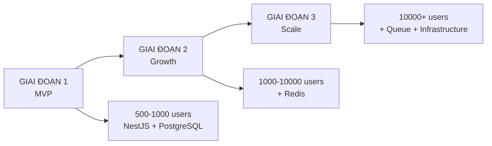

# Tối Ưu Hệ Thống Đặt Vé - Lộ Trình 3 Giai Đoạn

## 📋 Mục Lục

1. [Tổng Quan Lộ Trình](#-tổng-quan-lộ-trình)
2. [GIAI ĐOẠN 1: MVP - NestJS + PostgreSQL](#-giai-đoạn-1-mvp---nestjs--postgresql) ⭐ **Triển Khai**
3. [GIAI ĐOẠN 2: Growth - Thêm Redis](#-giai-đoạn-2-growth---thêm-redis) 🔮 Future
4. [GIAI ĐOẠN 3: Scale - Full Infrastructure](#-giai-đoạn-3-scale---full-infrastructure) 🔮 Future
5. [So Sánh Khả Năng](#-so-sánh-khả-năng-các-giai-đoạn)

---

## 🎯 Tổng Quan Lộ Trình

### Mục Tiêu Dự Án
Xây dựng hệ thống đặt vé sự kiện có khả năng xử lý **high-traffic** mà không bị:
- ❌ Race condition (nhiều người mua cùng 1 vé)
- ❌ Deadlock
- ❌ Performance bottleneck
- ❌ Data inconsistency

### Chiến Lược Phát Triển



### Quyết Định Kỹ Thuật

| Giai Đoạn | Stack | Target Users | Response Time | Độ Phức Tạp |
|-----------|-------|--------------|---------------|-------------|
| **1. MVP** | NestJS + PostgreSQL | 500-1,000 | < 2s | Thấp ⭐ |
| **2. Growth** | + Redis | 1,000-10,000 | < 1s | Trung Bình ⭐⭐ |
| **3. Scale** | + Queue + Replicas | 10,000+ | < 500ms | Cao ⭐⭐⭐ |

---

## ⭐ GIAI ĐOẠN 1: MVP - NestJS + PostgreSQL

> **🎯 MỤC TIÊU**: Xây dựng hệ thống MVP hoàn chỉnh chỉ với NestJS + PostgreSQL, xử lý được 500-1,000 concurrent users.

### 📊 Khả Năng Giai Đoạn 1

| Metric | Khả Năng |
|--------|----------|
| **Concurrent Users** | 500-1,000 |
| **Transactions/sec** | 50-200 |
| **Response Time** | < 2s |
| **Availability** | 99% |
| **Data Consistency** | ✅ ACID Guaranteed |

### 1.1 Database Schema Tối Ưu

#### Schema Đầy Đủ

```sql
-- =============================================
-- GIAI ĐOẠN 1: MVP SCHEMA
-- =============================================

-- Enable Extensions
CREATE EXTENSION IF NOT EXISTS "uuid-ossp";
CREATE EXTENSION IF NOT EXISTS "pg_trgm"; -- Text search

-- =============================================
-- 1. USERS TABLE
-- =============================================
CREATE TABLE users (
  id UUID PRIMARY KEY DEFAULT uuid_generate_v4(),
  email VARCHAR(255) UNIQUE NOT NULL,
  password_hash VARCHAR(255) NOT NULL,
  full_name VARCHAR(255) NOT NULL,
  profile_data JSONB DEFAULT '{}',
  role VARCHAR(20) NOT NULL DEFAULT 'user',
  created_at TIMESTAMP NOT NULL DEFAULT NOW(),
  updated_at TIMESTAMP NOT NULL DEFAULT NOW(),

  CONSTRAINT chk_users_role CHECK (role IN ('admin', 'user')),
  CONSTRAINT chk_users_email_format CHECK (email ~* '^[A-Za-z0-9._%+-]+@[A-Za-z0-9.-]+\.[A-Za-z]{2,}$')
);

-- Indexes
CREATE INDEX idx_users_email ON users(email);
CREATE INDEX idx_users_role ON users(role);
CREATE INDEX idx_users_created_at ON users(created_at);

-- =============================================
-- 2. EVENTS TABLE
-- =============================================
CREATE TABLE events (
  id UUID PRIMARY KEY DEFAULT uuid_generate_v4(),
  slug VARCHAR(255) UNIQUE NOT NULL,
  name VARCHAR(500) NOT NULL,
  description TEXT,
  banner_url VARCHAR(500),
  location VARCHAR(500) NOT NULL,
  start_time TIMESTAMP NOT NULL,
  end_time TIMESTAMP NOT NULL,
  status VARCHAR(20) NOT NULL DEFAULT 'DRAFT',
  created_at TIMESTAMP NOT NULL DEFAULT NOW(),
  updated_at TIMESTAMP NOT NULL DEFAULT NOW(),

  CONSTRAINT chk_events_status CHECK (status IN ('DRAFT', 'PUBLISHED', 'CANCELLED', 'ENDED')),
  CONSTRAINT chk_events_time CHECK (end_time > start_time)
);

-- Indexes
CREATE INDEX idx_events_slug ON events(slug);
CREATE INDEX idx_events_status ON events(status);
CREATE INDEX idx_events_start_time ON events(start_time);
CREATE INDEX idx_events_status_start_time ON events(status, start_time);
CREATE INDEX idx_events_name_text ON events USING gin(to_tsvector('english', name));

-- =============================================
-- 3. TICKET_TYPES TABLE
-- =============================================
CREATE TABLE ticket_types (
  id UUID PRIMARY KEY DEFAULT uuid_generate_v4(),
  event_id UUID NOT NULL,
  name VARCHAR(100) NOT NULL,
  price DECIMAL(10,2) NOT NULL,
  initial_quantity INT NOT NULL,
  available_quantity INT NOT NULL,
  start_sale_time TIMESTAMP,
  end_sale_time TIMESTAMP,
  version INT NOT NULL DEFAULT 1, -- Optimistic locking
  created_at TIMESTAMP NOT NULL DEFAULT NOW(),
  updated_at TIMESTAMP NOT NULL DEFAULT NOW(),

  CONSTRAINT chk_ticket_types_quantity CHECK (initial_quantity >= 0 AND available_quantity >= 0),
  CONSTRAINT chk_ticket_types_price CHECK (price >= 0),
  CONSTRAINT chk_ticket_types_available_lte_initial CHECK (available_quantity <= initial_quantity),
  CONSTRAINT fk_ticket_types_event FOREIGN KEY (event_id) REFERENCES events(id) ON DELETE CASCADE
);

-- Indexes
CREATE INDEX idx_ticket_types_event_id ON ticket_types(event_id);
CREATE INDEX idx_ticket_types_available ON ticket_types(available_quantity) WHERE available_quantity > 0;
CREATE INDEX idx_ticket_types_sale_time ON ticket_types(start_sale_time, end_sale_time);

-- =============================================
-- 4. ORDER_RESERVATIONS TABLE
-- =============================================
CREATE TABLE order_reservations (
  id UUID PRIMARY KEY DEFAULT uuid_generate_v4(),
  user_id UUID NOT NULL,
  ticket_type_id UUID NOT NULL,
  quantity INT NOT NULL,
  status VARCHAR(20) NOT NULL DEFAULT 'ACTIVE',
  expires_at TIMESTAMP NOT NULL,
  created_at TIMESTAMP NOT NULL DEFAULT NOW(),

  CONSTRAINT chk_reservations_quantity CHECK (quantity > 0),
  CONSTRAINT chk_reservations_status CHECK (status IN ('ACTIVE', 'COMPLETED', 'EXPIRED')),
  CONSTRAINT fk_reservations_user FOREIGN KEY (user_id) REFERENCES users(id) ON DELETE CASCADE,
  CONSTRAINT fk_reservations_ticket_type FOREIGN KEY (ticket_type_id) REFERENCES ticket_types(id) ON DELETE CASCADE
);

-- Indexes
CREATE INDEX idx_order_reservations_user_id ON order_reservations(user_id);
CREATE INDEX idx_order_reservations_ticket_type_id ON order_reservations(ticket_type_id);
CREATE INDEX idx_order_reservations_status ON order_reservations(status);
CREATE INDEX idx_order_reservations_expires_at ON order_reservations(expires_at) WHERE status = 'ACTIVE';

-- =============================================
-- 5. ORDERS TABLE
-- =============================================
CREATE TABLE orders (
  id UUID PRIMARY KEY DEFAULT uuid_generate_v4(),
  user_id UUID NOT NULL,
  total_amount DECIMAL(10,2) NOT NULL,
  status VARCHAR(20) NOT NULL DEFAULT 'PENDING',
  reservation_id UUID,
  created_at TIMESTAMP NOT NULL DEFAULT NOW(),
  updated_at TIMESTAMP NOT NULL DEFAULT NOW(),

  CONSTRAINT chk_orders_amount CHECK (total_amount >= 0),
  CONSTRAINT chk_orders_status CHECK (status IN ('PENDING', 'PAID', 'CANCELLED', 'TIMEOUT')),
  CONSTRAINT fk_orders_user FOREIGN KEY (user_id) REFERENCES users(id) ON DELETE RESTRICT,
  CONSTRAINT fk_orders_reservation FOREIGN KEY (reservation_id) REFERENCES order_reservations(id) ON DELETE SET NULL
);

-- Indexes
CREATE INDEX idx_orders_user_id ON orders(user_id);
CREATE INDEX idx_orders_status ON orders(status);
CREATE INDEX idx_orders_created_at ON orders(created_at);
CREATE INDEX idx_orders_user_status ON orders(user_id, status);

-- =============================================
-- 6. ORDER_ITEMS TABLE
-- =============================================
CREATE TABLE order_items (
  id UUID PRIMARY KEY DEFAULT uuid_generate_v4(),
  order_id UUID NOT NULL,
  ticket_type_id UUID NOT NULL,
  quantity INT NOT NULL,
  unit_price DECIMAL(10,2) NOT NULL,

  CONSTRAINT chk_order_items_quantity CHECK (quantity > 0),
  CONSTRAINT chk_order_items_price CHECK (unit_price >= 0),
  CONSTRAINT fk_order_items_order FOREIGN KEY (order_id) REFERENCES orders(id) ON DELETE CASCADE,
  CONSTRAINT fk_order_items_ticket_type FOREIGN KEY (ticket_type_id) REFERENCES ticket_types(id) ON DELETE RESTRICT
);

-- Indexes
CREATE INDEX idx_order_items_order_id ON order_items(order_id);
CREATE INDEX idx_order_items_ticket_type_id ON order_items(ticket_type_id);

-- =============================================
-- 7. PAYMENTS TABLE
-- =============================================
CREATE TABLE payments (
  id UUID PRIMARY KEY DEFAULT uuid_generate_v4(),
  order_id UUID UNIQUE NOT NULL,
  transaction_id VARCHAR(255) UNIQUE,
  payment_method VARCHAR(50) NOT NULL,
  amount DECIMAL(10,2) NOT NULL,
  status VARCHAR(20) NOT NULL DEFAULT 'PENDING',
  payment_time TIMESTAMP,
  created_at TIMESTAMP NOT NULL DEFAULT NOW(),

  CONSTRAINT chk_payments_amount CHECK (amount >= 0),
  CONSTRAINT chk_payments_method CHECK (payment_method IN ('MOMO', 'ZALOPAY', 'BANKING', 'CARD')),
  CONSTRAINT chk_payments_status CHECK (status IN ('PENDING', 'SUCCESS', 'FAILED')),
  CONSTRAINT fk_payments_order FOREIGN KEY (order_id) REFERENCES orders(id) ON DELETE CASCADE
);

-- Indexes
CREATE INDEX idx_payments_order_id ON payments(order_id);
CREATE INDEX idx_payments_transaction_id ON payments(transaction_id);
CREATE INDEX idx_payments_status ON payments(status);
CREATE INDEX idx_payments_payment_time ON payments(payment_time);

-- =============================================
-- 8. TICKETS TABLE
-- =============================================
CREATE TABLE tickets (
  id UUID PRIMARY KEY DEFAULT uuid_generate_v4(),
  order_id UUID NOT NULL,
  ticket_type_id UUID NOT NULL,
  ticket_code VARCHAR(50) UNIQUE NOT NULL,
  owner_name VARCHAR(255),
  status VARCHAR(20) NOT NULL DEFAULT 'UNUSED',
  checkin_time TIMESTAMP,
  created_at TIMESTAMP NOT NULL DEFAULT NOW(),

  CONSTRAINT chk_tickets_status CHECK (status IN ('UNUSED', 'CHECKED_IN', 'CANCELLED')),
  CONSTRAINT fk_tickets_order FOREIGN KEY (order_id) REFERENCES orders(id) ON DELETE CASCADE,
  CONSTRAINT fk_tickets_ticket_type FOREIGN KEY (ticket_type_id) REFERENCES ticket_types(id) ON DELETE RESTRICT
);

-- Indexes
CREATE INDEX idx_tickets_order_id ON tickets(order_id);
CREATE INDEX idx_tickets_ticket_type_id ON tickets(ticket_type_id);
CREATE INDEX idx_tickets_ticket_code ON tickets(ticket_code);
CREATE INDEX idx_tickets_status ON tickets(status);
CREATE INDEX idx_tickets_owner_name ON tickets(owner_name);

-- =============================================
-- TRIGGERS FOR UPDATED_AT
-- =============================================
CREATE OR REPLACE FUNCTION update_updated_at_column()
RETURNS TRIGGER AS $$
BEGIN
  NEW.updated_at = NOW();
  RETURN NEW;
END;
$$ LANGUAGE plpgsql;

CREATE TRIGGER update_users_updated_at BEFORE UPDATE ON users
  FOR EACH ROW EXECUTE FUNCTION update_updated_at_column();

CREATE TRIGGER update_events_updated_at BEFORE UPDATE ON events
  FOR EACH ROW EXECUTE FUNCTION update_updated_at_column();

CREATE TRIGGER update_ticket_types_updated_at BEFORE UPDATE ON ticket_types
  FOR EACH ROW EXECUTE FUNCTION update_updated_at_column();

CREATE TRIGGER update_orders_updated_at BEFORE UPDATE ON orders
  FOR EACH ROW EXECUTE FUNCTION update_updated_at_column();
```

### 1.2 Connection Pooling Configuration

```typescript
// database.config.ts
import { TypeOrmModuleOptions } from '@nestjs/typeorm';

export const databaseConfig: TypeOrmModuleOptions = {
  type: 'postgres',
  host: process.env.DB_HOST || 'localhost',
  port: parseInt(process.env.DB_PORT) || 5432,
  username: process.env.DB_USER || 'postgres',
  password: process.env.DB_PASSWORD,
  database: process.env.DB_NAME || 'event_booking',
  
  // Entities
  entities: [__dirname + '/../**/*.entity{.ts,.js}'],
  
  // Connection Pool Settings
  extra: {
    max: 20,                      // Maximum connections
    min: 5,                       // Minimum connections
    idleTimeoutMillis: 30000,     // Close idle connections after 30s
    connectionTimeoutMillis: 2000, // Fail fast if no connection
  },
  
  // Performance
  logging: process.env.NODE_ENV === 'development' ? ['error', 'warn'] : false,
  synchronize: false, // NEVER use in production
  
  // Migrations
  migrations: [__dirname + '/../migrations/**/*{.ts,.js}'],
  migrationsRun: false,
};
```

### 1.3 Xử Lý Race Condition

#### Phương Pháp 1: Pessimistic Locking (Khuyến Nghị)

```typescript
// booking.service.ts
import { Injectable, BadRequestException } from '@nestjs/common';
import { InjectDataSource } from '@nestjs/typeorm';
import { DataSource } from 'typeorm';

@Injectable()
export class BookingService {
  constructor(
    @InjectDataSource()
    private dataSource: DataSource,
  ) {}

  async reserveTicket(
    userId: string,
    ticketTypeId: string,
    quantity: number,
  ): Promise<OrderReservation> {
    const queryRunner = this.dataSource.createQueryRunner();
    await queryRunner.connect();
    await queryRunner.startTransaction();

    try {
      // 1. Lock row để tránh race condition
      const ticketType = await queryRunner.manager.findOne(TicketType, {
        where: { id: ticketTypeId },
        lock: { mode: 'pessimistic_write' }, // SELECT ... FOR UPDATE
      });

      if (!ticketType) {
        throw new BadRequestException('Loại vé không tồn tại');
      }

      if (ticketType.availableQuantity < quantity) {
        throw new BadRequestException('Không đủ vé');
      }

      // 2. Giảm số lượng vé
      ticketType.availableQuantity -= quantity;
      await queryRunner.manager.save(ticketType);

      // 3. Tạo reservation (giữ chỗ 10 phút)
      const expiresAt = new Date(Date.now() + 10 * 60 * 1000);
      const reservation = queryRunner.manager.create(OrderReservation, {
        userId,
        ticketTypeId,
        quantity,
        status: 'ACTIVE',
        expiresAt,
      });
      await queryRunner.manager.save(reservation);

      await queryRunner.commitTransaction();
      return reservation;

    } catch (error) {
      await queryRunner.rollbackTransaction();
      throw error;
    } finally {
      await queryRunner.release();
    }
  }
}
```

#### Phương Pháp 2: Optimistic Locking (Backup)

```typescript
// ticket-type.entity.ts
import { Entity, Column, VersionColumn } from 'typeorm';

@Entity('ticket_types')
export class TicketType {
  // ... other columns

  @VersionColumn()
  version: number;
}

// booking.service.ts
async reserveTicketOptimistic(
  userId: string,
  ticketTypeId: string,
  quantity: number,
  maxRetries: number = 3,
): Promise<OrderReservation> {
  for (let attempt = 0; attempt < maxRetries; attempt++) {
    try {
      return await this.attemptReservation(userId, ticketTypeId, quantity);
    } catch (error) {
      if (error.name === 'OptimisticLockVersionMismatchError' && attempt < maxRetries - 1) {
        // Retry after short delay
        await new Promise(resolve => setTimeout(resolve, 100 * (attempt + 1)));
        continue;
      }
      throw error;
    }
  }
  throw new Error('Failed to reserve ticket after retries');
}

private async attemptReservation(
  userId: string,
  ticketTypeId: string,
  quantity: number,
): Promise<OrderReservation> {
  const queryRunner = this.dataSource.createQueryRunner();
  await queryRunner.connect();
  await queryRunner.startTransaction();

  try {
    const ticketType = await queryRunner.manager.findOne(TicketType, {
      where: { id: ticketTypeId },
    });

    if (!ticketType || ticketType.availableQuantity < quantity) {
      throw new BadRequestException('Không đủ vé');
    }

    // Update với version check
    const result = await queryRunner.manager.update(
      TicketType,
      { id: ticketTypeId, version: ticketType.version },
      {
        availableQuantity: ticketType.availableQuantity - quantity,
        version: ticketType.version + 1,
      },
    );

    if (result.affected === 0) {
      throw new Error('OptimisticLockVersionMismatchError');
    }

    const reservation = queryRunner.manager.create(OrderReservation, {
      userId,
      ticketTypeId,
      quantity,
      status: 'ACTIVE',
      expiresAt: new Date(Date.now() + 10 * 60 * 1000),
    });
    await queryRunner.manager.save(reservation);

    await queryRunner.commitTransaction();
    return reservation;

  } catch (error) {
    await queryRunner.rollbackTransaction();
    throw error;
  } finally {
    await queryRunner.release();
  }
}
```

### 1.4 In-Memory Cache Đơn Giản

```typescript
// cache.service.ts
import { Injectable, Logger } from '@nestjs/common';

interface CacheEntry<T> {
  data: T;
  expiry: number;
}

@Injectable()
export class SimpleCacheService {
  private readonly logger = new Logger(SimpleCacheService.name);
  private cache = new Map<string, CacheEntry<any>>();

  get<T>(key: string): T | null {
    const entry = this.cache.get(key);
    
    if (!entry) {
      return null;
    }

    if (entry.expiry < Date.now()) {
      this.cache.delete(key);
      return null;
    }

    return entry.data;
  }

  set<T>(key: string, data: T, ttlSeconds: number = 300): void {
    this.cache.set(key, {
      data,
      expiry: Date.now() + ttlSeconds * 1000,
    });
  }

  delete(key: string): void {
    this.cache.delete(key);
  }

  clear(): void {
    this.cache.clear();
  }

  // Cleanup expired entries periodically
  cleanup(): void {
    const now = Date.now();
    let deleted = 0;

    for (const [key, entry] of this.cache.entries()) {
      if (entry.expiry < now) {
        this.cache.delete(key);
        deleted++;
      }
    }

    if (deleted > 0) {
      this.logger.log(`Cleaned up ${deleted} expired cache entries`);
    }
  }
}

// event.service.ts
@Injectable()
export class EventService {
  constructor(
    @InjectRepository(Event)
    private eventRepository: Repository<Event>,
    private cacheService: SimpleCacheService,
  ) {}

  async getPublishedEvents(): Promise<Event[]> {
    const cacheKey = 'events:published';
    
    // Try cache first
    const cached = this.cacheService.get<Event[]>(cacheKey);
    if (cached) {
      return cached;
    }

    // Query database
    const events = await this.eventRepository.find({
      where: { status: 'PUBLISHED' },
      order: { startTime: 'ASC' },
      relations: ['ticketTypes'],
    });

    // Cache for 5 minutes
    this.cacheService.set(cacheKey, events, 300);
    
    return events;
  }

  async updateEvent(id: string, dto: UpdateEventDto): Promise<Event> {
    const event = await this.eventRepository.save({ id, ...dto });
    
    // Invalidate cache
    this.cacheService.delete('events:published');
    
    return event;
  }
}
```

### 1.5 Scheduled Jobs Cleanup

```typescript
// cleanup.service.ts
import { Injectable, Logger } from '@nestjs/common';
import { Cron, CronExpression } from '@nestjs/schedule';
import { InjectDataSource } from '@nestjs/typeorm';
import { DataSource } from 'typeorm';

@Injectable()
export class CleanupService {
  private readonly logger = new Logger(CleanupService.name);

  constructor(
    @InjectDataSource()
    private dataSource: DataSource,
  ) {}

  // Chạy mỗi 5 phút - Release expired reservations
  @Cron(CronExpression.EVERY_5_MINUTES)
  async releaseExpiredReservations(): Promise<void> {
    const queryRunner = this.dataSource.createQueryRunner();
    await queryRunner.connect();
    await queryRunner.startTransaction();

    try {
      // 1. Tìm expired reservations
      const expiredReservations = await queryRunner.manager.query(`
        SELECT id, ticket_type_id, quantity
        FROM order_reservations
        WHERE status = 'ACTIVE' 
          AND expires_at < NOW()
        FOR UPDATE
      `);

      if (expiredReservations.length === 0) {
        await queryRunner.commitTransaction();
        return;
      }

      this.logger.log(`Found ${expiredReservations.length} expired reservations`);

      // 2. Mark as expired
      const reservationIds = expiredReservations.map(r => r.id);
      await queryRunner.manager.query(`
        UPDATE order_reservations
        SET status = 'EXPIRED'
        WHERE id = ANY($1)
      `, [reservationIds]);

      // 3. Release quantities back to ticket types
      for (const reservation of expiredReservations) {
        await queryRunner.manager.query(`
          UPDATE ticket_types
          SET available_quantity = available_quantity + $1
          WHERE id = $2
        `, [reservation.quantity, reservation.ticket_type_id]);
      }

      await queryRunner.commitTransaction();
      this.logger.log(`Released ${expiredReservations.length} expired reservations`);

    } catch (error) {
      await queryRunner.rollbackTransaction();
      this.logger.error('Failed to release expired reservations', error);
    } finally {
      await queryRunner.release();
    }
  }

  // Chạy mỗi ngày 2h sáng - Cleanup old completed reservations
  @Cron('0 2 * * *')
  async cleanupOldReservations(): Promise<void> {
    try {
      const result = await this.dataSource.query(`
        DELETE FROM order_reservations
        WHERE status IN ('COMPLETED', 'EXPIRED')
          AND created_at < NOW() - INTERVAL '30 days'
      `);

      this.logger.log(`Cleaned up ${result[1]} old reservations`);
    } catch (error) {
      this.logger.error('Failed to cleanup old reservations', error);
    }
  }

  // Chạy mỗi giờ - Cleanup in-memory cache
  @Cron(CronExpression.EVERY_HOUR)
  async cleanupCache(): Promise<void> {
    // Implement cache cleanup logic
    this.logger.log('Cache cleanup completed');
  }
}

// app.module.ts
import { ScheduleModule } from '@nestjs/schedule';

@Module({
  imports: [
    ScheduleModule.forRoot(),
    // ... other imports
  ],
  providers: [CleanupService],
})
export class AppModule {}
```

### 1.6 PostgreSQL Configuration

```conf
# postgresql.conf (optimized for 4GB RAM server)

# Connection settings
max_connections = 100
shared_buffers = 1GB              # 25% of RAM
effective_cache_size = 3GB        # 75% of RAM
maintenance_work_mem = 256MB
checkpoint_completion_target = 0.9
wal_buffers = 16MB
default_statistics_target = 100
random_page_cost = 1.1            # For SSD
effective_io_concurrency = 200
work_mem = 10MB                   # Per connection

# Logging slow queries
log_min_duration_statement = 1000 # Log queries > 1s
log_line_prefix = '%m [%p] %u@%d '
log_statement = 'none'
log_duration = off

# Lock timeout
deadlock_timeout = 1s
lock_timeout = 5s

# Autovacuum (important for performance)
autovacuum = on
autovacuum_max_workers = 3
autovacuum_naptime = 1min
```

### 1.7 Booking Flow Hoàn Chỉnh

```typescript
// booking.controller.ts
@Controller('bookings')
@UseGuards(JwtAuthGuard)
export class BookingController {
  constructor(private readonly bookingService: BookingService) {}

  // Step 1: Reserve tickets (giữ chỗ)
  @Post('reserve')
  async reserveTickets(
    @CurrentUser() user: User,
    @Body() dto: ReserveTicketsDto,
  ): Promise<OrderReservation> {
    return this.bookingService.reserveTicket(
      user.id,
      dto.ticketTypeId,
      dto.quantity,
    );
  }

  // Step 2: Complete booking (sau khi user điền thông tin)
  @Post('complete/:reservationId')
  async completeBooking(
    @CurrentUser() user: User,
    @Param('reservationId') reservationId: string,
    @Body() dto: CompleteBookingDto,
  ): Promise<Order> {
    return this.bookingService.completeBooking(user.id, reservationId, dto);
  }

  // Get user's bookings
  @Get('my-bookings')
  async getMyBookings(@CurrentUser() user: User): Promise<Order[]> {
    return this.bookingService.getUserBookings(user.id);
  }
}

// booking.service.ts
@Injectable()
export class BookingService {
  constructor(
    @InjectDataSource() private dataSource: DataSource,
    @InjectRepository(Order) private orderRepository: Repository<Order>,
    @InjectRepository(OrderReservation) private reservationRepository: Repository<OrderReservation>,
  ) {}

  async completeBooking(
    userId: string,
    reservationId: string,
    dto: CompleteBookingDto,
  ): Promise<Order> {
    const queryRunner = this.dataSource.createQueryRunner();
    await queryRunner.connect();
    await queryRunner.startTransaction();

    try {
      // 1. Verify reservation
      const reservation = await queryRunner.manager.findOne(OrderReservation, {
        where: { id: reservationId, userId, status: 'ACTIVE' },
        relations: ['ticketType'],
      });

      if (!reservation) {
        throw new BadRequestException('Reservation không tồn tại hoặc đã hết hạn');
      }

      if (reservation.expiresAt < new Date()) {
        throw new BadRequestException('Reservation đã hết hạn');
      }

      // 2. Create order
      const totalAmount = reservation.ticketType.price * reservation.quantity;
      const order = queryRunner.manager.create(Order, {
        userId,
        totalAmount,
        status: 'PENDING',
        reservationId: reservation.id,
      });
      await queryRunner.manager.save(order);

      // 3. Create order items
      const orderItem = queryRunner.manager.create(OrderItem, {
        orderId: order.id,
        ticketTypeId: reservation.ticketTypeId,
        quantity: reservation.quantity,
        unitPrice: reservation.ticketType.price,
      });
      await queryRunner.manager.save(orderItem);

      // 4. Create payment record (SUCCESS ngay lập tức)
      const payment = queryRunner.manager.create(Payment, {
        orderId: order.id,
        amount: totalAmount,
        paymentMethod: dto.paymentMethod,
        status: 'SUCCESS', // ⭐ Lưu trực tiếp với status SUCCESS
        paymentTime: new Date(),
        transactionId: `TXN_${Date.now()}`,
      });
      await queryRunner.manager.save(payment);

      // 5. Mark reservation as completed
      reservation.status = 'COMPLETED';
      await queryRunner.manager.save(reservation);

      await queryRunner.commitTransaction();

      // 6. Generate tickets asynchronously (không block transaction)
      this.generateTicketsAsync(order.id)
        .catch(error => console.error('Ticket generation error:', error));

      return order;

    } catch (error) {
      await queryRunner.rollbackTransaction();
      throw error;
    } finally {
      await queryRunner.release();
    }
  }

  // ⭐ GIAI ĐOẠN 1: GENERATE TICKETS ASYNC
  // Tickets được tạo sau khi order + payment đã commit
  private async generateTicketsAsync(orderId: string): Promise<void> {
    const queryRunner = this.dataSource.createQueryRunner();
    await queryRunner.connect();
    await queryRunner.startTransaction();

    try {
      const order = await queryRunner.manager.findOne(Order, {
        where: { id: orderId },
        relations: ['orderItems', 'orderItems.ticketType'],
      });

      if (!order) {
        throw new Error('Order not found');
      }

      // Update order status to PAID
      await queryRunner.manager.update(Order, { id: orderId }, {
        status: 'PAID',
      });

      // Generate tickets for each order item
      for (const item of order.orderItems) {
        for (let i = 0; i < item.quantity; i++) {
          const ticket = queryRunner.manager.create(Ticket, {
            orderId: order.id,
            ticketTypeId: item.ticketTypeId,
            ticketCode: this.generateTicketCode(),
            status: 'ACTIVE',
          });
          await queryRunner.manager.save(ticket);
        }
      }

      await queryRunner.commitTransaction();

      // Send confirmation email (không await)
      this.sendConfirmationEmail(orderId)
        .catch(error => console.error('Email error:', error));

    } catch (error) {
      await queryRunner.rollbackTransaction();
      console.error('Ticket generation failed:', error);
    } finally {
      await queryRunner.release();
    }
  }

  private generateTicketCode(): string {
    const timestamp = Date.now().toString(36);
    const random = Math.random().toString(36).substring(2, 8);
    return `TKT-${timestamp}-${random}`.toUpperCase();
  }

  private async sendConfirmationEmail(orderId: string): Promise<void> {
    // TODO: Implement email sending logic
    console.log(`Sending confirmation email for order ${orderId}`);
  }

  async getUserBookings(userId: string): Promise<Order[]> {
      where: { userId },
      relations: ['orderItems', 'orderItems.ticketType', 'payment', 'tickets'],
      order: { createdAt: 'DESC' },
    });
  }
}
```

### 1.8 Checklist Triển Khai Giai Đoạn 1

- [ ] **Database Setup**
  - [ ] Tạo database schema với tất cả indexes
  - [ ] Cấu hình connection pooling
  - [ ] Setup PostgreSQL optimization
  - [ ] Tạo triggers cho updated_at

- [ ] **Core Features**
  - [ ] Implement pessimistic locking cho reservation
  - [ ] Implement optimistic locking (backup)
  - [ ] Timeout mechanism cho reservations (10 phút)
  - [ ] Transaction safety cho tất cả critical operations

- [ ] **Performance**
  - [ ] In-memory cache cho static data (events list)
  - [ ] Query optimization (select specific columns)
  - [ ] Proper indexes cho tất cả queries

- [ ] **Background Jobs**
  - [ ] Scheduled job cleanup expired reservations (5 phút)
  - [ ] Scheduled job cleanup old data (daily)
  - [ ] Async payment processing
  - [ ] Async email sending

- [ ] **Error Handling**
  - [ ] Comprehensive try-catch blocks
  - [ ] Rollback transactions on error
  - [ ] Proper error messages
  - [ ] Logging

- [ ] **Testing**
  - [ ] Unit tests cho services
  - [ ] Integration tests cho booking flow
  - [ ] Load testing với 500-1000 concurrent users

---

## 🔮 GIAI ĐOẠN 2: Growth - Thêm Redis

> **🎯 MỤC TIÊU**: Scale lên 1,000-10,000 concurrent users bằng cách thêm Redis caching.

### 📊 Khả Năng Giai Đoạn 2

| Metric | Khả Năng |
|--------|----------|
| **Concurrent Users** | 1,000-10,000 |
| **Transactions/sec** | 200-500 |
| **Response Time** | < 1s |
| **Cache Hit Rate** | 80-90% |

### 2.1 Redis Caching Strategy

```typescript
// Sẽ implement trong tương lai
// - Redis cho distributed cache
// - Share cache giữa nhiều instances
// - TTL tự động
// - Cache invalidation patterns
```

### 2.2 Rate Limiting với Redis

```typescript
// Sẽ implement trong tương lai
// - Rate limit per user
// - Rate limit per IP
// - Sliding window algorithm
```

### 2.3 Session Management

```typescript
// Sẽ implement trong tương lai
// - Redis session store
// - JWT token blacklist
```

---

## 🔮 GIAI ĐOẠN 3: Scale - Full Infrastructure

> **🎯 MỤC TIÊU**: Scale lên 10,000+ concurrent users với full infrastructure.

### 📊 Khả Năng Giai Đoạn 3

| Metric | Khả Năng |
|--------|----------|
| **Concurrent Users** | 10,000+ |
| **Transactions/sec** | 500-1000+ |
| **Response Time** | < 500ms |
| **Availability** | 99.9% |

### 3.1 Bull Queue System

```typescript
// Sẽ implement trong tương lai
// - Job queue với retry logic
// - Priority queues
// - Job monitoring
// - Distributed processing
```

### 3.2 Read Replicas

```typescript
// Sẽ implement trong tương lai
// - Master-slave replication
// - Read query routing
// - Automatic failover
```

### 3.3 Monitoring Stack

```typescript
// Sẽ implement trong tương lai
// - Prometheus metrics
// - Grafana dashboards
// - Alert manager
// - APM tools
```

---

## 📊 So Sánh Khả Năng Các Giai Đoạn

### Performance Metrics

| Feature | Giai Đoạn 1 | Giai Đoạn 2 | Giai Đoạn 3 |
|---------|-------------|-------------|-------------|
| **Concurrent Users** | 500-1,000 | 1,000-10,000 | 10,000+ |
| **Response Time** | < 2s | < 1s | < 500ms |
| **Transactions/sec** | 50-200 | 200-500 | 500-1000+ |
| **Cache** | In-memory | Redis | Redis + CDN |
| **Queue** | ❌ | ❌ | ✅ Bull |
| **Database** | Single | Single | Master + Replicas |
| **Availability** | 99% | 99.5% | 99.9% |

### Technology Stack

| Component | Giai Đoạn 1 | Giai Đoạn 2 | Giai Đoạn 3 |
|-----------|-------------|-------------|-------------|
| **Backend** | NestJS | NestJS | NestJS |
| **Database** | PostgreSQL | PostgreSQL | PostgreSQL + Replicas |
| **Cache** | In-memory Map | Redis | Redis + CDN |
| **Queue** | - | - | Bull/BullMQ |
| **Monitoring** | Basic logging | + Redis monitoring | Full stack (Prometheus/Grafana) |
| **Load Balancer** | - | - | Nginx/HAProxy |

### Cost Estimate (Monthly)

| Service | Giai Đoạn 1 | Giai Đoạn 2 | Giai Đoạn 3 |
|---------|-------------|-------------|-------------|
| **Server** | $20-50 | $50-100 | $200-500 |
| **Database** | $20-40 | $40-80 | $100-300 |
| **Redis** | - | $10-30 | $30-100 |
| **Monitoring** | Free | $10-20 | $50-150 |
| **Total** | **$40-90** | **$110-230** | **$380-1050** |

---

## 🎯 Lộ Trình Triển Khai

### Phase 1: MVP (Tuần 1-4)
- [ ] Setup database schema
- [ ] Implement core booking flow
- [ ] Pessimistic locking
- [ ] Basic caching
- [ ] Scheduled cleanup jobs
- [ ] Testing

### Phase 2: Optimization (Tuần 5-6)
- [ ] Query optimization
- [ ] Index tuning
- [ ] Connection pool tuning
- [ ] Load testing
- [ ] Performance monitoring

### Phase 3: Production Ready (Tuần 7-8)
- [ ] Error handling
- [ ] Logging
- [ ] Documentation
- [ ] Deployment
- [ ] Monitoring setup

### Phase 4: Growth (Future)
- [ ] Redis integration
- [ ] Horizontal scaling
- [ ] Advanced monitoring

### Phase 5: Scale (Future)
- [ ] Queue system
- [ ] Read replicas
- [ ] CDN integration
- [ ] Full monitoring stack

---

## 📝 Kết Luận

### Giai Đoạn 1 (Đang Triển Khai)

**Ưu điểm:**
- ✅ Đơn giản, dễ triển khai
- ✅ Chi phí thấp ($40-90/month)
- ✅ Đủ cho MVP và startup nhỏ
- ✅ ACID compliance đầy đủ
- ✅ Không cần học công nghệ mới

**Giới hạn:**
- ⚠️ Không scale horizontal
- ⚠️ Cache không distributed
- ⚠️ Single point of failure
- ⚠️ Max 500-1,000 concurrent users

**Khi nào nâng cấp lên Giai Đoạn 2:**
- Traffic > 500 concurrent users
- Response time > 2s
- Cần scale horizontal
- Cần cache distributed

---

**📌 NOTE**: Document này sẽ được cập nhật khi triển khai các giai đoạn tiếp theo.
