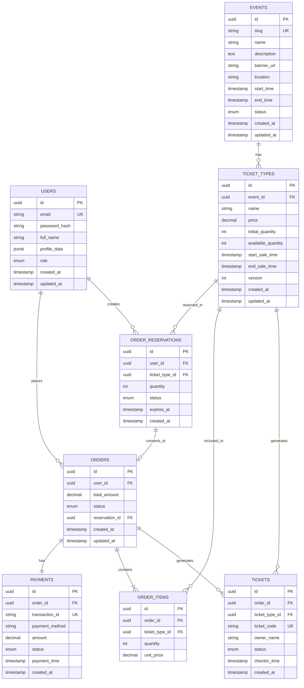

# Database Schema - Event Booking System

## Tổng Quan

Hệ thống quản lý đặt vé sự kiện với 8 bảng chính:

- **users** - Quản lý người dùng (Admin & User)
- **events** - Quản lý sự kiện
- **ticket_types** - Các loại vé của sự kiện (VIP, Standard, Economy...)
- **order_reservations** - Giữ chỗ tạm thời khi đặt vé
- **orders** - Đơn hàng
- **order_items** - Chi tiết các vé trong đơn hàng
- **payments** - Thông tin thanh toán
- **tickets** - Vé đã được tạo (QR code)

---

## Entity Relationship Diagram



---

## Chi Tiết Các Bảng

### 1. USERS

Quản lý thông tin người dùng (Admin và User thường).

| Column        | Type         | Constraints              | Description                                |
| ------------- | ------------ | ------------------------ | ------------------------------------------ |
| id            | UUID         | PRIMARY KEY              | ID duy nhất                                |
| email         | VARCHAR(255) | UNIQUE, NOT NULL         | Email đăng nhập                            |
| password_hash | VARCHAR(255) | NOT NULL                 | Mật khẩu đã hash (bcrypt)                  |
| full_name     | VARCHAR(255) | NOT NULL                 | Họ tên đầy đủ                              |
| profile_data  | JSONB        | NULL                     | Thông tin bổ sung (phone, address, avatar) |
| role          | VARCHAR(20)  | NOT NULL, DEFAULT 'user' | Vai trò: 'admin', 'user'                   |
| created_at    | TIMESTAMP    | DEFAULT NOW()            | Thời gian tạo                              |
| updated_at    | TIMESTAMP    | DEFAULT NOW()            | Thời gian cập nhật                         |

**Indexes:**

```sql
CREATE INDEX idx_users_email ON users(email);
CREATE INDEX idx_users_role ON users(role);
CREATE INDEX idx_users_created_at ON users(created_at);
```

**Constraints:**

```sql
ALTER TABLE users ADD CONSTRAINT chk_users_role
  CHECK (role IN ('admin', 'user'));

ALTER TABLE users ADD CONSTRAINT chk_users_email_format
  CHECK (email ~* '^[A-Za-z0-9._%+-]+@[A-Za-z0-9.-]+\.[A-Za-z]{2,}$');
```

**Example Data:**

```json
{
  "id": "550e8400-e29b-41d4-a716-446655440000",
  "email": "admin@example.com",
  "password_hash": "$2b$10$...",
  "full_name": "Nguyễn Văn A",
  "profile_data": {
    "phone": "+84123456789",
    "address": "123 Đường ABC, Q1, TP.HCM",
    "avatar": "https://example.com/avatar.jpg"
  },
  "role": "admin",
  "created_at": "2024-01-15T10:30:00Z"
}
```

---

### 2. EVENTS

Quản lý các sự kiện.

| Column      | Type         | Constraints               | Description             |
| ----------- | ------------ | ------------------------- | ----------------------- |
| id          | UUID         | PRIMARY KEY               | ID duy nhất             |
| slug        | VARCHAR(255) | UNIQUE, NOT NULL          | URL-friendly identifier |
| name        | VARCHAR(500) | NOT NULL                  | Tên sự kiện             |
| description | TEXT         | NULL                      | Mô tả chi tiết          |
| banner_url  | VARCHAR(500) | NULL                      | Link ảnh banner         |
| location    | VARCHAR(500) | NOT NULL                  | Địa điểm tổ chức        |
| start_time  | TIMESTAMP    | NOT NULL                  | Thời gian bắt đầu       |
| end_time    | TIMESTAMP    | NOT NULL                  | Thời gian kết thúc      |
| status      | VARCHAR(20)  | NOT NULL, DEFAULT 'DRAFT' | Trạng thái sự kiện      |
| created_at  | TIMESTAMP    | DEFAULT NOW()             | Thời gian tạo           |
| updated_at  | TIMESTAMP    | DEFAULT NOW()             | Thời gian cập nhật      |

**Status Values:**

- `DRAFT` - Nháp, chưa công bố
- `PUBLISHED` - Đã công bố, đang mở bán
- `CANCELLED` - Đã hủy
- `ENDED` - Đã kết thúc

**Indexes:**

```sql
CREATE INDEX idx_events_slug ON events(slug);
CREATE INDEX idx_events_status ON events(status);
CREATE INDEX idx_events_start_time ON events(start_time);
CREATE INDEX idx_events_status_start_time ON events(status, start_time);
CREATE INDEX idx_events_name_text ON events USING gin(to_tsvector('english', name));
```

**Constraints:**

```sql
ALTER TABLE events ADD CONSTRAINT chk_events_status
  CHECK (status IN ('DRAFT', 'PUBLISHED', 'CANCELLED', 'ENDED'));

ALTER TABLE events ADD CONSTRAINT chk_events_time
  CHECK (end_time > start_time);
```

**Example Data:**

```json
{
  "id": "650e8400-e29b-41d4-a716-446655440000",
  "slug": "tech-conference-2024",
  "name": "Tech Conference 2024",
  "description": "Hội nghị công nghệ lớn nhất năm 2024...",
  "banner_url": "https://example.com/banner.jpg",
  "location": "SECC - 799 Nguyễn Văn Linh, Q7, TP.HCM",
  "start_time": "2024-06-15T08:00:00Z",
  "end_time": "2024-06-15T18:00:00Z",
  "status": "PUBLISHED",
  "created_at": "2024-01-15T10:30:00Z"
}
```

---

### 3. TICKET_TYPES

Các loại vé của một sự kiện (VIP, Standard, Early Bird...).

| Column             | Type          | Constraints              | Description                    |
| ------------------ | ------------- | ------------------------ | ------------------------------ |
| id                 | UUID          | PRIMARY KEY              | ID duy nhất                    |
| event_id           | UUID          | FK → events.id, NOT NULL | Sự kiện                        |
| name               | VARCHAR(100)  | NOT NULL                 | Tên loại vé                    |
| price              | DECIMAL(10,2) | NOT NULL                 | Giá vé                         |
| initial_quantity   | INT           | NOT NULL                 | Số lượng ban đầu               |
| available_quantity | INT           | NOT NULL                 | Số lượng còn lại               |
| start_sale_time    | TIMESTAMP     | NULL                     | Thời gian bắt đầu bán          |
| end_sale_time      | TIMESTAMP     | NULL                     | Thời gian kết thúc bán         |
| version            | INT           | DEFAULT 1                | Version cho optimistic locking |
| created_at         | TIMESTAMP     | DEFAULT NOW()            | Thời gian tạo                  |
| updated_at         | TIMESTAMP     | DEFAULT NOW()            | Thời gian cập nhật             |

**Indexes:**

```sql
CREATE INDEX idx_ticket_types_event_id ON ticket_types(event_id);
CREATE INDEX idx_ticket_types_available ON ticket_types(available_quantity)
  WHERE available_quantity > 0;
CREATE INDEX idx_ticket_types_sale_time ON ticket_types(start_sale_time, end_sale_time);
```

**Constraints:**

```sql
ALTER TABLE ticket_types ADD CONSTRAINT chk_ticket_types_quantity
  CHECK (initial_quantity >= 0 AND available_quantity >= 0);

ALTER TABLE ticket_types ADD CONSTRAINT chk_ticket_types_price
  CHECK (price >= 0);

ALTER TABLE ticket_types ADD CONSTRAINT chk_ticket_types_available_lte_initial
  CHECK (available_quantity <= initial_quantity);

ALTER TABLE ticket_types ADD CONSTRAINT fk_ticket_types_event
  FOREIGN KEY (event_id) REFERENCES events(id) ON DELETE CASCADE;
```

**Example Data:**

```json
{
  "id": "750e8400-e29b-41d4-a716-446655440000",
  "event_id": "650e8400-e29b-41d4-a716-446655440000",
  "name": "VIP",
  "price": 500000.0,
  "initial_quantity": 100,
  "available_quantity": 85,
  "start_sale_time": "2024-03-01T00:00:00Z",
  "end_sale_time": "2024-06-14T23:59:59Z",
  "version": 1,
  "created_at": "2024-01-15T10:30:00Z"
}
```

---

### 4. ORDER_RESERVATIONS

Giữ chỗ tạm thời khi người dùng đặt vé (timeout sau 10-15 phút).

| Column         | Type        | Constraints                    | Description       |
| -------------- | ----------- | ------------------------------ | ----------------- |
| id             | UUID        | PRIMARY KEY                    | ID duy nhất       |
| user_id        | UUID        | FK → users.id, NOT NULL        | Người đặt         |
| ticket_type_id | UUID        | FK → ticket_types.id, NOT NULL | Loại vé           |
| quantity       | INT         | NOT NULL                       | Số lượng giữ chỗ  |
| status         | VARCHAR(20) | NOT NULL, DEFAULT 'ACTIVE'     | Trạng thái        |
| expires_at     | TIMESTAMP   | NOT NULL                       | Thời gian hết hạn |
| created_at     | TIMESTAMP   | DEFAULT NOW()                  | Thời gian tạo     |

**Status Values:**

- `ACTIVE` - Đang giữ chỗ
- `COMPLETED` - Đã chuyển thành order
- `EXPIRED` - Hết hạn, đã release

**Indexes:**

```sql
CREATE INDEX idx_order_reservations_user_id ON order_reservations(user_id);
CREATE INDEX idx_order_reservations_ticket_type_id ON order_reservations(ticket_type_id);
CREATE INDEX idx_order_reservations_status ON order_reservations(status);
CREATE INDEX idx_order_reservations_expires_at ON order_reservations(expires_at)
  WHERE status = 'ACTIVE';
```

**Constraints:**

```sql
ALTER TABLE order_reservations ADD CONSTRAINT chk_reservations_quantity
  CHECK (quantity > 0);

ALTER TABLE order_reservations ADD CONSTRAINT chk_reservations_status
  CHECK (status IN ('ACTIVE', 'COMPLETED', 'EXPIRED'));

ALTER TABLE order_reservations ADD CONSTRAINT fk_reservations_user
  FOREIGN KEY (user_id) REFERENCES users(id) ON DELETE CASCADE;

ALTER TABLE order_reservations ADD CONSTRAINT fk_reservations_ticket_type
  FOREIGN KEY (ticket_type_id) REFERENCES ticket_types(id) ON DELETE CASCADE;
```

**Example Data:**

```json
{
  "id": "850e8400-e29b-41d4-a716-446655440000",
  "user_id": "550e8400-e29b-41d4-a716-446655440000",
  "ticket_type_id": "750e8400-e29b-41d4-a716-446655440000",
  "quantity": 2,
  "status": "ACTIVE",
  "expires_at": "2024-01-15T10:45:00Z",
  "created_at": "2024-01-15T10:35:00Z"
}
```

---

### 5. ORDERS

Đơn hàng đã xác nhận.

| Column         | Type          | Constraints                      | Description        |
| -------------- | ------------- | -------------------------------- | ------------------ |
| id             | UUID          | PRIMARY KEY                      | ID duy nhất        |
| user_id        | UUID          | FK → users.id, NOT NULL          | Người đặt          |
| total_amount   | DECIMAL(10,2) | NOT NULL                         | Tổng tiền          |
| status         | VARCHAR(20)   | NOT NULL, DEFAULT 'PENDING'      | Trạng thái         |
| reservation_id | UUID          | FK → order_reservations.id, NULL | ID reservation gốc |
| created_at     | TIMESTAMP     | DEFAULT NOW()                    | Thời gian tạo      |
| updated_at     | TIMESTAMP     | DEFAULT NOW()                    | Thời gian cập nhật |

**Status Values:**

- `PENDING` - Chờ thanh toán
- `PAID` - Đã thanh toán
- `CANCELLED` - Đã hủy
- `TIMEOUT` - Hết thời gian thanh toán

**Indexes:**

```sql
CREATE INDEX idx_orders_user_id ON orders(user_id);
CREATE INDEX idx_orders_status ON orders(status);
CREATE INDEX idx_orders_created_at ON orders(created_at);
CREATE INDEX idx_orders_user_status ON orders(user_id, status);
```

**Constraints:**

```sql
ALTER TABLE orders ADD CONSTRAINT chk_orders_amount
  CHECK (total_amount >= 0);

ALTER TABLE orders ADD CONSTRAINT chk_orders_status
  CHECK (status IN ('PENDING', 'PAID', 'CANCELLED', 'TIMEOUT'));

ALTER TABLE orders ADD CONSTRAINT fk_orders_user
  FOREIGN KEY (user_id) REFERENCES users(id) ON DELETE RESTRICT;

ALTER TABLE orders ADD CONSTRAINT fk_orders_reservation
  FOREIGN KEY (reservation_id) REFERENCES order_reservations(id) ON DELETE SET NULL;
```

**Example Data:**

```json
{
  "id": "950e8400-e29b-41d4-a716-446655440000",
  "user_id": "550e8400-e29b-41d4-a716-446655440000",
  "total_amount": 1000000.0,
  "status": "PAID",
  "reservation_id": "850e8400-e29b-41d4-a716-446655440000",
  "created_at": "2024-01-15T10:40:00Z",
  "updated_at": "2024-01-15T10:42:00Z"
}
```

---

### 6. ORDER_ITEMS

Chi tiết các loại vé trong đơn hàng.

| Column         | Type          | Constraints                    | Description                  |
| -------------- | ------------- | ------------------------------ | ---------------------------- |
| id             | UUID          | PRIMARY KEY                    | ID duy nhất                  |
| order_id       | UUID          | FK → orders.id, NOT NULL       | Đơn hàng                     |
| ticket_type_id | UUID          | FK → ticket_types.id, NOT NULL | Loại vé                      |
| quantity       | INT           | NOT NULL                       | Số lượng                     |
| unit_price     | DECIMAL(10,2) | NOT NULL                       | Giá mỗi vé tại thời điểm mua |

**Indexes:**

```sql
CREATE INDEX idx_order_items_order_id ON order_items(order_id);
CREATE INDEX idx_order_items_ticket_type_id ON order_items(ticket_type_id);
```

**Constraints:**

```sql
ALTER TABLE order_items ADD CONSTRAINT chk_order_items_quantity
  CHECK (quantity > 0);

ALTER TABLE order_items ADD CONSTRAINT chk_order_items_price
  CHECK (unit_price >= 0);

ALTER TABLE order_items ADD CONSTRAINT fk_order_items_order
  FOREIGN KEY (order_id) REFERENCES orders(id) ON DELETE CASCADE;

ALTER TABLE order_items ADD CONSTRAINT fk_order_items_ticket_type
  FOREIGN KEY (ticket_type_id) REFERENCES ticket_types(id) ON DELETE RESTRICT;
```

**Example Data:**

```json
{
  "id": "a50e8400-e29b-41d4-a716-446655440000",
  "order_id": "950e8400-e29b-41d4-a716-446655440000",
  "ticket_type_id": "750e8400-e29b-41d4-a716-446655440000",
  "quantity": 2,
  "unit_price": 500000.0
}
```

---

### 7. PAYMENTS

Thông tin thanh toán cho đơn hàng.

| Column         | Type          | Constraints                      | Description                     |
| -------------- | ------------- | -------------------------------- | ------------------------------- |
| id             | UUID          | PRIMARY KEY                      | ID duy nhất                     |
| order_id       | UUID          | FK → orders.id, UNIQUE, NOT NULL | Đơn hàng (1 order = 1 payment)  |
| transaction_id | VARCHAR(255)  | UNIQUE, NULL                     | Mã giao dịch từ payment gateway |
| payment_method | VARCHAR(50)   | NOT NULL                         | Phương thức thanh toán          |
| amount         | DECIMAL(10,2) | NOT NULL                         | Số tiền                         |
| status         | VARCHAR(20)   | NOT NULL, DEFAULT 'PENDING'      | Trạng thái                      |
| payment_time   | TIMESTAMP     | NULL                             | Thời gian thanh toán thành công |
| created_at     | TIMESTAMP     | DEFAULT NOW()                    | Thời gian tạo                   |

**Payment Methods:**

- `MOMO` - Ví MoMo
- `ZALOPAY` - Ví ZaloPay
- `BANKING` - Chuyển khoản ngân hàng
- `CARD` - Thẻ tín dụng/ghi nợ

**Status Values:**

- `PENDING` - Chờ thanh toán
- `SUCCESS` - Thành công
- `FAILED` - Thất bại

**Indexes:**

```sql
CREATE INDEX idx_payments_order_id ON payments(order_id);
CREATE INDEX idx_payments_transaction_id ON payments(transaction_id);
CREATE INDEX idx_payments_status ON payments(status);
CREATE INDEX idx_payments_payment_time ON payments(payment_time);
```

**Constraints:**

```sql
ALTER TABLE payments ADD CONSTRAINT chk_payments_amount
  CHECK (amount >= 0);

ALTER TABLE payments ADD CONSTRAINT chk_payments_method
  CHECK (payment_method IN ('MOMO', 'ZALOPAY', 'BANKING', 'CARD'));

ALTER TABLE payments ADD CONSTRAINT chk_payments_status
  CHECK (status IN ('PENDING', 'SUCCESS', 'FAILED'));

ALTER TABLE payments ADD CONSTRAINT fk_payments_order
  FOREIGN KEY (order_id) REFERENCES orders(id) ON DELETE CASCADE;
```

**Example Data:**

```json
{
  "id": "b50e8400-e29b-41d4-a716-446655440000",
  "order_id": "950e8400-e29b-41d4-a716-446655440000",
  "transaction_id": "MOMO_TXN_123456789",
  "payment_method": "MOMO",
  "amount": 1000000.0,
  "status": "SUCCESS",
  "payment_time": "2024-01-15T10:42:00Z",
  "created_at": "2024-01-15T10:40:00Z"
}
```

---

### 8. TICKETS

Vé đã được tạo (sau khi thanh toán thành công).

| Column         | Type         | Constraints                    | Description            |
| -------------- | ------------ | ------------------------------ | ---------------------- |
| id             | UUID         | PRIMARY KEY                    | ID duy nhất            |
| order_id       | UUID         | FK → orders.id, NOT NULL       | Đơn hàng               |
| ticket_type_id | UUID         | FK → ticket_types.id, NOT NULL | Loại vé                |
| ticket_code    | VARCHAR(50)  | UNIQUE, NOT NULL               | Mã vé (QR code string) |
| owner_name     | VARCHAR(255) | NULL                           | Tên người sở hữu vé    |
| status         | VARCHAR(20)  | NOT NULL, DEFAULT 'UNUSED'     | Trạng thái             |
| checkin_time   | TIMESTAMP    | NULL                           | Thời gian check-in     |
| created_at     | TIMESTAMP    | DEFAULT NOW()                  | Thời gian tạo          |

**Status Values:**

- `UNUSED` - Chưa sử dụng
- `CHECKED_IN` - Đã check-in
- `CANCELLED` - Đã hủy

**Indexes:**

```sql
CREATE INDEX idx_tickets_order_id ON tickets(order_id);
CREATE INDEX idx_tickets_ticket_type_id ON tickets(ticket_type_id);
CREATE INDEX idx_tickets_ticket_code ON tickets(ticket_code);
CREATE INDEX idx_tickets_status ON tickets(status);
CREATE INDEX idx_tickets_owner_name ON tickets(owner_name);
```

**Constraints:**

```sql
ALTER TABLE tickets ADD CONSTRAINT chk_tickets_status
  CHECK (status IN ('UNUSED', 'CHECKED_IN', 'CANCELLED'));

ALTER TABLE tickets ADD CONSTRAINT fk_tickets_order
  FOREIGN KEY (order_id) REFERENCES orders(id) ON DELETE CASCADE;

ALTER TABLE tickets ADD CONSTRAINT fk_tickets_ticket_type
  FOREIGN KEY (ticket_type_id) REFERENCES ticket_types(id) ON DELETE RESTRICT;
```

**Example Data:**

```json
{
  "id": "c50e8400-e29b-41d4-a716-446655440000",
  "order_id": "950e8400-e29b-41d4-a716-446655440000",
  "ticket_type_id": "750e8400-e29b-41d4-a716-446655440000",
  "ticket_code": "TC2024-ABCD-1234",
  "owner_name": "Nguyễn Văn B",
  "status": "UNUSED",
  "checkin_time": null,
  "created_at": "2024-01-15T10:43:00Z"
}
```

---

## Complete SQL Migration Script

```sql
-- =============================================
-- Event Booking System - Database Schema
-- =============================================

-- Enable UUID extension
CREATE EXTENSION IF NOT EXISTS "uuid-ossp";
CREATE EXTENSION IF NOT EXISTS "pg_trgm"; -- For text search

-- =============================================
-- 1. USERS TABLE
-- =============================================
CREATE TABLE users (
  id UUID PRIMARY KEY DEFAULT uuid_generate_v4(),
  email VARCHAR(255) UNIQUE NOT NULL,
  password_hash VARCHAR(255) NOT NULL,
  full_name VARCHAR(255) NOT NULL,
  profile_data JSONB DEFAULT '{}',
  role VARCHAR(20) NOT NULL DEFAULT 'user',
  created_at TIMESTAMP NOT NULL DEFAULT NOW(),
  updated_at TIMESTAMP NOT NULL DEFAULT NOW(),

  CONSTRAINT chk_users_role CHECK (role IN ('admin', 'user')),
  CONSTRAINT chk_users_email_format CHECK (email ~* '^[A-Za-z0-9._%+-]+@[A-Za-z0-9.-]+\.[A-Za-z]{2,}$')
);

CREATE INDEX idx_users_email ON users(email);
CREATE INDEX idx_users_role ON users(role);
CREATE INDEX idx_users_created_at ON users(created_at);

COMMENT ON TABLE users IS 'Quản lý người dùng hệ thống';
COMMENT ON COLUMN users.profile_data IS 'JSON chứa phone, address, avatar...';

-- =============================================
-- 2. EVENTS TABLE
-- =============================================
CREATE TABLE events (
  id UUID PRIMARY KEY DEFAULT uuid_generate_v4(),
  slug VARCHAR(255) UNIQUE NOT NULL,
  name VARCHAR(500) NOT NULL,
  description TEXT,
  banner_url VARCHAR(500),
  location VARCHAR(500) NOT NULL,
  start_time TIMESTAMP NOT NULL,
  end_time TIMESTAMP NOT NULL,
  status VARCHAR(20) NOT NULL DEFAULT 'DRAFT',
  created_at TIMESTAMP NOT NULL DEFAULT NOW(),
  updated_at TIMESTAMP NOT NULL DEFAULT NOW(),

  CONSTRAINT chk_events_status CHECK (status IN ('DRAFT', 'PUBLISHED', 'CANCELLED', 'ENDED')),
  CONSTRAINT chk_events_time CHECK (end_time > start_time)
);

CREATE INDEX idx_events_slug ON events(slug);
CREATE INDEX idx_events_status ON events(status);
CREATE INDEX idx_events_start_time ON events(start_time);
CREATE INDEX idx_events_status_start_time ON events(status, start_time);
CREATE INDEX idx_events_name_text ON events USING gin(to_tsvector('english', name));

COMMENT ON TABLE events IS 'Quản lý sự kiện';

-- =============================================
-- 3. TICKET_TYPES TABLE
-- =============================================
CREATE TABLE ticket_types (
  id UUID PRIMARY KEY DEFAULT uuid_generate_v4(),
  event_id UUID NOT NULL,
  name VARCHAR(100) NOT NULL,
  price DECIMAL(10,2) NOT NULL,
  initial_quantity INT NOT NULL,
  available_quantity INT NOT NULL,
  start_sale_time TIMESTAMP,
  end_sale_time TIMESTAMP,
  version INT NOT NULL DEFAULT 1,
  created_at TIMESTAMP NOT NULL DEFAULT NOW(),
  updated_at TIMESTAMP NOT NULL DEFAULT NOW(),

  CONSTRAINT chk_ticket_types_quantity CHECK (initial_quantity >= 0 AND available_quantity >= 0),
  CONSTRAINT chk_ticket_types_price CHECK (price >= 0),
  CONSTRAINT chk_ticket_types_available_lte_initial CHECK (available_quantity <= initial_quantity),
  CONSTRAINT fk_ticket_types_event FOREIGN KEY (event_id) REFERENCES events(id) ON DELETE CASCADE
);

CREATE INDEX idx_ticket_types_event_id ON ticket_types(event_id);
CREATE INDEX idx_ticket_types_available ON ticket_types(available_quantity) WHERE available_quantity > 0;
CREATE INDEX idx_ticket_types_sale_time ON ticket_types(start_sale_time, end_sale_time);

COMMENT ON TABLE ticket_types IS 'Các loại vé của sự kiện';
COMMENT ON COLUMN ticket_types.version IS 'Optimistic locking version';

-- =============================================
-- 4. ORDER_RESERVATIONS TABLE
-- =============================================
CREATE TABLE order_reservations (
  id UUID PRIMARY KEY DEFAULT uuid_generate_v4(),
  user_id UUID NOT NULL,
  ticket_type_id UUID NOT NULL,
  quantity INT NOT NULL,
  status VARCHAR(20) NOT NULL DEFAULT 'ACTIVE',
  expires_at TIMESTAMP NOT NULL,
  created_at TIMESTAMP NOT NULL DEFAULT NOW(),

  CONSTRAINT chk_reservations_quantity CHECK (quantity > 0),
  CONSTRAINT chk_reservations_status CHECK (status IN ('ACTIVE', 'COMPLETED', 'EXPIRED')),
  CONSTRAINT fk_reservations_user FOREIGN KEY (user_id) REFERENCES users(id) ON DELETE CASCADE,
  CONSTRAINT fk_reservations_ticket_type FOREIGN KEY (ticket_type_id) REFERENCES ticket_types(id) ON DELETE CASCADE
);

CREATE INDEX idx_order_reservations_user_id ON order_reservations(user_id);
CREATE INDEX idx_order_reservations_ticket_type_id ON order_reservations(ticket_type_id);
CREATE INDEX idx_order_reservations_status ON order_reservations(status);
CREATE INDEX idx_order_reservations_expires_at ON order_reservations(expires_at) WHERE status = 'ACTIVE';

COMMENT ON TABLE order_reservations IS 'Giữ chỗ tạm thời khi đặt vé (10-15 phút)';

-- =============================================
-- 5. ORDERS TABLE
-- =============================================
CREATE TABLE orders (
  id UUID PRIMARY KEY DEFAULT uuid_generate_v4(),
  user_id UUID NOT NULL,
  total_amount DECIMAL(10,2) NOT NULL,
  status VARCHAR(20) NOT NULL DEFAULT 'PENDING',
  reservation_id UUID,
  created_at TIMESTAMP NOT NULL DEFAULT NOW(),
  updated_at TIMESTAMP NOT NULL DEFAULT NOW(),

  CONSTRAINT chk_orders_amount CHECK (total_amount >= 0),
  CONSTRAINT chk_orders_status CHECK (status IN ('PENDING', 'PAID', 'CANCELLED', 'TIMEOUT')),
  CONSTRAINT fk_orders_user FOREIGN KEY (user_id) REFERENCES users(id) ON DELETE RESTRICT,
  CONSTRAINT fk_orders_reservation FOREIGN KEY (reservation_id) REFERENCES order_reservations(id) ON DELETE SET NULL
);

CREATE INDEX idx_orders_user_id ON orders(user_id);
CREATE INDEX idx_orders_status ON orders(status);
CREATE INDEX idx_orders_created_at ON orders(created_at);
CREATE INDEX idx_orders_user_status ON orders(user_id, status);

COMMENT ON TABLE orders IS 'Đơn hàng đã xác nhận';

-- =============================================
-- 6. ORDER_ITEMS TABLE
-- =============================================
CREATE TABLE order_items (
  id UUID PRIMARY KEY DEFAULT uuid_generate_v4(),
  order_id UUID NOT NULL,
  ticket_type_id UUID NOT NULL,
  quantity INT NOT NULL,
  unit_price DECIMAL(10,2) NOT NULL,

  CONSTRAINT chk_order_items_quantity CHECK (quantity > 0),
  CONSTRAINT chk_order_items_price CHECK (unit_price >= 0),
  CONSTRAINT fk_order_items_order FOREIGN KEY (order_id) REFERENCES orders(id) ON DELETE CASCADE,
  CONSTRAINT fk_order_items_ticket_type FOREIGN KEY (ticket_type_id) REFERENCES ticket_types(id) ON DELETE RESTRICT
);

CREATE INDEX idx_order_items_order_id ON order_items(order_id);
CREATE INDEX idx_order_items_ticket_type_id ON order_items(ticket_type_id);

COMMENT ON TABLE order_items IS 'Chi tiết các loại vé trong đơn hàng';

-- =============================================
-- 7. PAYMENTS TABLE
-- =============================================
CREATE TABLE payments (
  id UUID PRIMARY KEY DEFAULT uuid_generate_v4(),
  order_id UUID UNIQUE NOT NULL,
  transaction_id VARCHAR(255) UNIQUE,
  payment_method VARCHAR(50) NOT NULL,
  amount DECIMAL(10,2) NOT NULL,
  status VARCHAR(20) NOT NULL DEFAULT 'PENDING',
  payment_time TIMESTAMP,
  created_at TIMESTAMP NOT NULL DEFAULT NOW(),

  CONSTRAINT chk_payments_amount CHECK (amount >= 0),
  CONSTRAINT chk_payments_method CHECK (payment_method IN ('MOMO', 'ZALOPAY', 'BANKING', 'CARD')),
  CONSTRAINT chk_payments_status CHECK (status IN ('PENDING', 'SUCCESS', 'FAILED')),
  CONSTRAINT fk_payments_order FOREIGN KEY (order_id) REFERENCES orders(id) ON DELETE CASCADE
);

CREATE INDEX idx_payments_order_id ON payments(order_id);
CREATE INDEX idx_payments_transaction_id ON payments(transaction_id);
CREATE INDEX idx_payments_status ON payments(status);
CREATE INDEX idx_payments_payment_time ON payments(payment_time);

COMMENT ON TABLE payments IS 'Thông tin thanh toán';

-- =============================================
-- 8. TICKETS TABLE
-- =============================================
CREATE TABLE tickets (
  id UUID PRIMARY KEY DEFAULT uuid_generate_v4(),
  order_id UUID NOT NULL,
  ticket_type_id UUID NOT NULL,
  ticket_code VARCHAR(50) UNIQUE NOT NULL,
  owner_name VARCHAR(255),
  status VARCHAR(20) NOT NULL DEFAULT 'UNUSED',
  checkin_time TIMESTAMP,
  created_at TIMESTAMP NOT NULL DEFAULT NOW(),

  CONSTRAINT chk_tickets_status CHECK (status IN ('UNUSED', 'CHECKED_IN', 'CANCELLED')),
  CONSTRAINT fk_tickets_order FOREIGN KEY (order_id) REFERENCES orders(id) ON DELETE CASCADE,
  CONSTRAINT fk_tickets_ticket_type FOREIGN KEY (ticket_type_id) REFERENCES ticket_types(id) ON DELETE RESTRICT
);

CREATE INDEX idx_tickets_order_id ON tickets(order_id);
CREATE INDEX idx_tickets_ticket_type_id ON tickets(ticket_type_id);
CREATE INDEX idx_tickets_ticket_code ON tickets(ticket_code);
CREATE INDEX idx_tickets_status ON tickets(status);
CREATE INDEX idx_tickets_owner_name ON tickets(owner_name);

COMMENT ON TABLE tickets IS 'Vé đã được tạo (QR code)';

-- =============================================
-- TRIGGERS FOR UPDATED_AT
-- =============================================
CREATE OR REPLACE FUNCTION update_updated_at_column()
RETURNS TRIGGER AS $$
BEGIN
  NEW.updated_at = NOW();
  RETURN NEW;
END;
$$ LANGUAGE plpgsql;

CREATE TRIGGER update_users_updated_at BEFORE UPDATE ON users
  FOR EACH ROW EXECUTE FUNCTION update_updated_at_column();

CREATE TRIGGER update_events_updated_at BEFORE UPDATE ON events
  FOR EACH ROW EXECUTE FUNCTION update_updated_at_column();

CREATE TRIGGER update_ticket_types_updated_at BEFORE UPDATE ON ticket_types
  FOR EACH ROW EXECUTE FUNCTION update_updated_at_column();

CREATE TRIGGER update_orders_updated_at BEFORE UPDATE ON orders
  FOR EACH ROW EXECUTE FUNCTION update_updated_at_column();

-- =============================================
-- SAMPLE DATA
-- =============================================

-- Insert admin user (password: admin123)
INSERT INTO users (id, email, password_hash, full_name, role) VALUES
  ('550e8400-e29b-41d4-a716-446655440000', 'admin@example.com', '$2b$10$rBXNFLPmHVG3LFOi7nFHDeMwN5cQPwLqwVCk9qTEO0hQX2AqDVPNS', 'Admin User', 'admin');

-- Insert sample event
INSERT INTO events (id, slug, name, description, location, start_time, end_time, status) VALUES
  ('650e8400-e29b-41d4-a716-446655440000', 'tech-conference-2024', 'Tech Conference 2024', 'Hội nghị công nghệ lớn nhất năm', 'SECC - TP.HCM', '2024-06-15 08:00:00', '2024-06-15 18:00:00', 'PUBLISHED');

-- Insert ticket types
INSERT INTO ticket_types (id, event_id, name, price, initial_quantity, available_quantity) VALUES
  ('750e8400-e29b-41d4-a716-446655440000', '650e8400-e29b-41d4-a716-446655440000', 'VIP', 500000.00, 100, 100),
  ('751e8400-e29b-41d4-a716-446655440000', '650e8400-e29b-41d4-a716-446655440000', 'Standard', 300000.00, 500, 500),
  ('752e8400-e29b-41d4-a716-446655440000', '650e8400-e29b-41d4-a716-446655440000', 'Early Bird', 200000.00, 200, 200);
```

---

## TypeORM Entities

### User Entity

```typescript
import {
  Entity,
  PrimaryGeneratedColumn,
  Column,
  CreateDateColumn,
  UpdateDateColumn,
  OneToMany,
} from "typeorm";
import { Order } from "./order.entity";

export enum UserRole {
  ADMIN = "admin",
  USER = "user",
}

@Entity("users")
export class User {
  @PrimaryGeneratedColumn("uuid")
  id: string;

  @Column({ unique: true })
  email: string;

  @Column({ name: "password_hash" })
  passwordHash: string;

  @Column({ name: "full_name" })
  fullName: string;

  @Column({ type: "jsonb", default: {} })
  profileData: Record<string, any>;

  @Column({ type: "enum", enum: UserRole, default: UserRole.USER })
  role: UserRole;

  @CreateDateColumn({ name: "created_at" })
  createdAt: Date;

  @UpdateDateColumn({ name: "updated_at" })
  updatedAt: Date;

  @OneToMany(() => Order, (order) => order.user)
  orders: Order[];
}
```

### Event Entity

```typescript
import {
  Entity,
  PrimaryGeneratedColumn,
  Column,
  CreateDateColumn,
  UpdateDateColumn,
  OneToMany,
} from "typeorm";
import { TicketType } from "./ticket-type.entity";

export enum EventStatus {
  DRAFT = "DRAFT",
  PUBLISHED = "PUBLISHED",
  CANCELLED = "CANCELLED",
  ENDED = "ENDED",
}

@Entity("events")
export class Event {
  @PrimaryGeneratedColumn("uuid")
  id: string;

  @Column({ unique: true })
  slug: string;

  @Column()
  name: string;

  @Column({ type: "text", nullable: true })
  description: string;

  @Column({ name: "banner_url", nullable: true })
  bannerUrl: string;

  @Column()
  location: string;

  @Column({ name: "start_time", type: "timestamp" })
  startTime: Date;

  @Column({ name: "end_time", type: "timestamp" })
  endTime: Date;

  @Column({ type: "enum", enum: EventStatus, default: EventStatus.DRAFT })
  status: EventStatus;

  @CreateDateColumn({ name: "created_at" })
  createdAt: Date;

  @UpdateDateColumn({ name: "updated_at" })
  updatedAt: Date;

  @OneToMany(() => TicketType, (ticketType) => ticketType.event)
  ticketTypes: TicketType[];
}
```

### TicketType Entity

```typescript
import {
  Entity,
  PrimaryGeneratedColumn,
  Column,
  CreateDateColumn,
  UpdateDateColumn,
  ManyToOne,
  JoinColumn,
} from "typeorm";
import { Event } from "./event.entity";

@Entity("ticket_types")
export class TicketType {
  @PrimaryGeneratedColumn("uuid")
  id: string;

  @Column({ name: "event_id" })
  eventId: string;

  @Column()
  name: string;

  @Column({ type: "decimal", precision: 10, scale: 2 })
  price: number;

  @Column({ name: "initial_quantity" })
  initialQuantity: number;

  @Column({ name: "available_quantity" })
  availableQuantity: number;

  @Column({ name: "start_sale_time", type: "timestamp", nullable: true })
  startSaleTime: Date;

  @Column({ name: "end_sale_time", type: "timestamp", nullable: true })
  endSaleTime: Date;

  @Column({ default: 1 })
  version: number;

  @CreateDateColumn({ name: "created_at" })
  createdAt: Date;

  @UpdateDateColumn({ name: "updated_at" })
  updatedAt: Date;

  @ManyToOne(() => Event, (event) => event.ticketTypes)
  @JoinColumn({ name: "event_id" })
  event: Event;
}
```

### Order Entity

```typescript
import {
  Entity,
  PrimaryGeneratedColumn,
  Column,
  CreateDateColumn,
  UpdateDateColumn,
  ManyToOne,
  OneToMany,
  OneToOne,
  JoinColumn,
} from "typeorm";
import { User } from "./user.entity";
import { OrderItem } from "./order-item.entity";
import { Payment } from "./payment.entity";

export enum OrderStatus {
  PENDING = "PENDING",
  PAID = "PAID",
  CANCELLED = "CANCELLED",
  TIMEOUT = "TIMEOUT",
}

@Entity("orders")
export class Order {
  @PrimaryGeneratedColumn("uuid")
  id: string;

  @Column({ name: "user_id" })
  userId: string;

  @Column({ name: "total_amount", type: "decimal", precision: 10, scale: 2 })
  totalAmount: number;

  @Column({ type: "enum", enum: OrderStatus, default: OrderStatus.PENDING })
  status: OrderStatus;

  @Column({ name: "reservation_id", nullable: true })
  reservationId: string;

  @CreateDateColumn({ name: "created_at" })
  createdAt: Date;

  @UpdateDateColumn({ name: "updated_at" })
  updatedAt: Date;

  @ManyToOne(() => User, (user) => user.orders)
  @JoinColumn({ name: "user_id" })
  user: User;

  @OneToMany(() => OrderItem, (orderItem) => orderItem.order)
  orderItems: OrderItem[];

  @OneToOne(() => Payment, (payment) => payment.order)
  payment: Payment;
}
```

---

## Common Queries

### Lấy events đang mở bán

```sql
SELECT e.*,
  COUNT(DISTINCT tt.id) as ticket_type_count,
  MIN(tt.price) as min_price,
  MAX(tt.price) as max_price
FROM events e
LEFT JOIN ticket_types tt ON tt.event_id = e.id
WHERE e.status = 'PUBLISHED'
  AND e.start_time > NOW()
  AND tt.available_quantity > 0
GROUP BY e.id
ORDER BY e.start_time ASC;
```

### Lấy bookings của user

```sql
SELECT
  o.id,
  o.total_amount,
  o.status,
  o.created_at,
  json_agg(json_build_object(
    'ticket_type', tt.name,
    'quantity', oi.quantity,
    'unit_price', oi.unit_price
  )) as items
FROM orders o
INNER JOIN order_items oi ON oi.order_id = o.id
INNER JOIN ticket_types tt ON tt.id = oi.ticket_type_id
WHERE o.user_id = :userId
GROUP BY o.id
ORDER BY o.created_at DESC;
```

### Check available quantity

```sql
SELECT
  id,
  name,
  price,
  available_quantity,
  CASE
    WHEN available_quantity > 0 THEN 'available'
    ELSE 'sold_out'
  END as availability_status
FROM ticket_types
WHERE event_id = :eventId
  AND (start_sale_time IS NULL OR start_sale_time <= NOW())
  AND (end_sale_time IS NULL OR end_sale_time >= NOW());
```

---

## Notes

1. **UUID vs Auto-increment**: Sử dụng UUID để tránh lộ thông tin về số lượng records
2. **Soft Delete**: Chưa implement, có thể thêm `deleted_at` column nếu cần
3. **Audit Log**: Có thể thêm bảng `audit_logs` để track mọi thay đổi quan trọng
4. **Full-text Search**: Đã có GIN index cho `events.name`, có thể mở rộng cho description
5. **Partitioning**: Orders có thể partition theo `created_at` nếu data lớn
