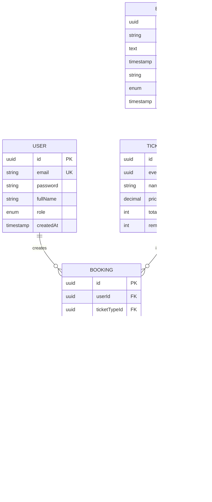

# Hệ Thống Đặt Vé Sự Kiện NestJS

## Tổng quan

Xây dựng hệ thống backend đặt vé sự kiện với NestJS, TypeScript strict, JWT authentication, PostgreSQL/TypeORM, hỗ trợ nhiều loại vé và mock payment.

---

## 1. Kiến trúc tổng quan


---

## 2. Database Schema



---

## 3. Cấu trúc thư mục dự án

```
src/
├── main.ts
├── app.module.ts
├── common/
│   ├── decorators/
│   │   ├── roles.decorator.ts
│   │   └── current-user.decorator.ts
│   ├── guards/
│   │   ├── jwt-auth.guard.ts
│   │   └── roles.guard.ts
│   ├── interceptors/
│   │   └── logging.interceptor.ts
│   ├── filters/
│   │   └── http-exception.filter.ts
│   ├── pipes/
│   │   └── parse-uuid.pipe.ts
│   └── enums/
│       ├── role.enum.ts
│       ├── booking-status.enum.ts
│       └── payment-status.enum.ts
├── config/
│   └── database.config.ts
├── modules/
│   ├── auth/
│   │   ├── auth.module.ts
│   │   ├── auth.controller.ts
│   │   ├── auth.service.ts
│   │   ├── strategies/
│   │   │   └── jwt.strategy.ts
│   │   └── dto/
│   │       ├── login.dto.ts
│   │       └── register.dto.ts
│   ├── user/
│   │   ├── user.module.ts
│   │   ├── user.service.ts
│   │   ├── user.repository.ts
│   │   └── entities/
│   │       └── user.entity.ts
│   ├── event/
│   │   ├── event.module.ts
│   │   ├── event.controller.ts
│   │   ├── event.service.ts
│   │   ├── entities/
│   │   │   └── event.entity.ts
│   │   └── dto/
│   │       ├── create-event.dto.ts
│   │       └── update-event.dto.ts
│   ├── ticket/
│   │   ├── ticket.module.ts
│   │   ├── ticket.controller.ts
│   │   ├── ticket.service.ts
│   │   ├── entities/
│   │   │   └── ticket-type.entity.ts
│   │   └── dto/
│   │       └── create-ticket-type.dto.ts
│   ├── booking/
│   │   ├── booking.module.ts
│   │   ├── booking.controller.ts
│   │   ├── booking.service.ts
│   │   ├── entities/
│   │   │   └── booking.entity.ts
│   │   └── dto/
│   │       └── create-booking.dto.ts
│   └── payment/
│       ├── payment.module.ts
│       ├── payment.service.ts
│       ├── entities/
│       │   └── payment.entity.ts
│       └── dto/
│           └── process-payment.dto.ts
└── test/
    ├── auth.service.spec.ts
    ├── booking.service.spec.ts
    └── e2e/
```

---

## 4. API Endpoints

### 4.1 Public APIs (Không cần xác thực)

| Method | Endpoint | Mô tả |
|--------|----------|-------|
| POST | `/auth/register` | Đăng ký tài khoản mới |
| POST | `/auth/login` | Đăng nhập lấy JWT token |
| GET | `/events` | Lấy danh sách sự kiện |
| GET | `/events/:id` | Chi tiết sự kiện và các loại vé |

### 4.2 Protected APIs (User + Admin)

| Method | Endpoint | Mô tả |
|--------|----------|-------|
| POST | `/bookings` | Đặt vé sự kiện |
| GET | `/bookings/me` | Xem danh sách booking của mình |
| GET | `/bookings/:id` | Chi tiết một booking |
| POST | `/payments/:bookingId/process` | Xử lý thanh toán (mock) |

### 4.3 Admin Only APIs

| Method | Endpoint | Mô tả |
|--------|----------|-------|
| POST | `/events` | Tạo sự kiện mới |
| PUT | `/events/:id` | Cập nhật sự kiện |
| DELETE | `/events/:id` | Xóa sự kiện |
| POST | `/events/:id/tickets` | Tạo loại vé cho sự kiện |
| GET | `/admin/bookings` | Xem tất cả booking |
| GET | `/admin/users` | Quản lý users |

---

## 5. Flow nghiệp vụ đặt vé


---

## 6. Kỹ thuật nâng cao áp dụng

### 6.1 Guards & Decorators

```typescript
// Bảo vệ API bằng JWT
@UseGuards(JwtAuthGuard)
@Get('bookings/me')
getMyBookings(@CurrentUser() user: User) {
  return this.bookingService.findByUser(user.id);
}

// Phân quyền Admin
@UseGuards(JwtAuthGuard, RolesGuard)
@Roles(Role.ADMIN)
@Post('events')
createEvent(@Body() dto: CreateEventDto) {
  return this.eventService.create(dto);
}
```

### 6.2 Validation với DTO

```typescript
// create-booking.dto.ts
import { IsUUID, IsInt, Min, Max } from 'class-validator';

export class CreateBookingDto {
  @IsUUID()
  ticketTypeId: string;

  @IsInt()
  @Min(1)
  @Max(10)
  quantity: number;
}
```

### 6.3 Global Exception Filter

```typescript
@Catch(HttpException)
export class HttpExceptionFilter implements ExceptionFilter {
  catch(exception: HttpException, host: ArgumentsHost) {
    const ctx = host.switchToHttp();
    const response = ctx.getResponse<Response>();
    const status = exception.getStatus();

    response.status(status).json({
      success: false,
      statusCode: status,
      message: exception.message,
      timestamp: new Date().toISOString(),
    });
  }
}
```

### 6.4 Logging Interceptor

```typescript
@Injectable()
export class LoggingInterceptor implements NestInterceptor {
  intercept(context: ExecutionContext, next: CallHandler): Observable<any> {
    const request = context.switchToHttp().getRequest();
    const now = Date.now();

    return next.handle().pipe(
      tap(() => {
        console.log(`${request.method} ${request.url} - ${Date.now() - now}ms`);
      }),
    );
  }
}
```

---

## 7. Danh sách Dependencies

```json
{
  "dependencies": {
    "@nestjs/common": "^10.x",
    "@nestjs/core": "^10.x",
    "@nestjs/jwt": "^10.x",
    "@nestjs/passport": "^10.x",
    "@nestjs/typeorm": "^10.x",
    "@nestjs/config": "^3.x",
    "passport": "^0.7.x",
    "passport-jwt": "^4.x",
    "typeorm": "^0.3.x",
    "pg": "^8.x",
    "class-validator": "^0.14.x",
    "class-transformer": "^0.5.x",
    "bcrypt": "^5.x"
  },
  "devDependencies": {
    "@nestjs/testing": "^10.x",
    "@types/jest": "^29.x",
    "jest": "^29.x",
    "ts-jest": "^29.x"
  }
}
```

---

## 8. Checklist triển khai

- [ ] Khởi tạo NestJS project và cài đặt dependencies
- [ ] Cấu hình PostgreSQL và TypeORM connection
- [ ] Tạo common module: guards, decorators, filters, interceptors, enums
- [ ] Tạo User module và entity
- [ ] Tạo Auth module: JWT strategy, login, register
- [ ] Tạo Event module: CRUD sự kiện
- [ ] Tạo Ticket module: quản lý loại vé và số lượng
- [ ] Tạo Booking module: logic đặt vé, kiểm tra availability
- [ ] Tạo Payment module: mock payment flow
- [ ] Viết unit tests cho các service chính
- [ ] Tạo API documentation và README

---

## 9. Phân công module (theo tài liệu)

| Module | Mô tả |
|--------|-------|
| Auth & User Module | Đăng ký, đăng nhập, JWT, phân quyền |
| Event & Ticket Module | CRUD sự kiện, quản lý loại vé |
| Booking Module | Logic đặt vé, kiểm tra số lượng |
| Test & Optimization | Unit test, performance |

---

## 10. Ghi chú kỹ thuật

1. **Type Safety**: Không sử dụng `any`, mọi request/response đều có type
2. **Transaction**: Sử dụng transaction khi đặt vé để đảm bảo data integrity
3. **Validation**: Mọi input đều được validate qua DTO và ValidationPipe
4. **Error Handling**: Sử dụng Exception Filter để xử lý lỗi tập trung
5. **Testing**: Viết unit test cho business logic quan trọng


