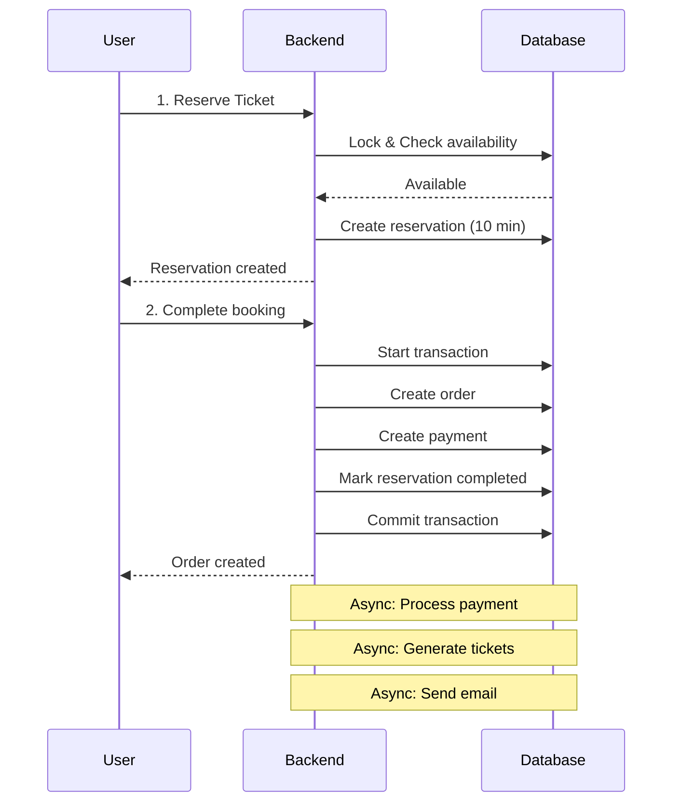

# Tóm Tắt Dự Án - Project Summary

## 🎯 Tổng Quan Nhanh

**Dự án**: Hệ thống đặt vé sự kiện với NestJS  
**Mục tiêu**: Xây dựng backend có khả năng xử lý high-traffic  
**Chiến lược**: Phát triển 3 giai đoạn từ MVP → Growth → Scale  
**Giai đoạn hiện tại**: ⭐ GIAI ĐOẠN 1 - MVP (NestJS + PostgreSQL)

---

## 📊 Quick Stats

| Aspect | Target |
|--------|--------|
| **Timeline** | 8 tuần |
| **Concurrent Users** | 500-1,000 |
| **Response Time** | < 2s |
| **Technology Stack** | NestJS + TypeORM + PostgreSQL |
| **Cost/Month** | $40-90 |
| **Team Size** | 1-2 người |

---

## 🎯 Vấn Đề Cần Giải Quyết

### Core Problems

1. **Race Condition**
   - Nhiều người mua cùng 1 vé
   - **Giải pháp**: Pessimistic Locking

2. **Inventory Management**
   - Vé bị giữ mãi mãi
   - **Giải pháp**: Reservation với timeout 10 phút

3. **Performance**
   - Chậm khi nhiều người truy cập
   - **Giải pháp**: Indexes + Connection pooling + Caching

4. **Data Consistency**
   - Transaction không an toàn
   - **Giải pháp**: ACID transactions với QueryRunner

---

## 🏗️ Kiến Trúc Solution

### Database Schema (8 Tables)

```
users ─┐
       ├─→ orders ─┬─→ order_items ──→ ticket_types ──→ events
       │           ├─→ payments
       │           └─→ tickets
       │
       └─→ order_reservations ──→ ticket_types
```

### Booking Flow



### Key Features

1. **Pessimistic Locking**
   ```sql
   SELECT * FROM ticket_types 
   WHERE id = ? FOR UPDATE
   ```

2. **Reservation Timeout**
   ```typescript
   expiresAt = Date.now() + 10 * 60 * 1000 // 10 minutes
   ```

3. **Scheduled Cleanup**
   ```typescript
   @Cron(CronExpression.EVERY_5_MINUTES)
   async releaseExpiredReservations()
   ```

4. **In-Memory Cache**
   ```typescript
   private cache = new Map<string, CacheEntry>();
   ```

---

## 📁 File Structure

### Documentation (Đã tạo)

```
doc/
├── LỜI MỞ ĐẦU.md               ✅ Project introduction
├── KNOWLEDGE.md                 ✅ NestJS learning guide
├── DATABASE_SCHEMA.md           ✅ Complete schema (8 tables)
├── DATABASE_OPTIMIZATION.md     ✅ 3-phase roadmap
├── IMPLEMENTATION_ROADMAP.md    ✅ 8-week timeline
├── TECHNICAL_DECISIONS.md       ✅ Why we chose what
├── NESTJS_CLI_GUIDE.md          ✅ NestJS CLI commands
└── PROJECT_SUMMARY.md           ✅ This file (overview)
```

### Code Structure (Sẽ tạo)

```
src/
├── modules/
│   ├── auth/           # JWT authentication
│   ├── users/          # User management
│   ├── events/         # Event CRUD
│   ├── tickets/        # Ticket types
│   ├── bookings/       # ⭐ Core booking logic
│   └── payments/       # Payment processing
├── common/
│   ├── cache/          # SimpleCacheService
│   ├── guards/         # JwtAuthGuard
│   └── interceptors/   # Logging, Transform
├── config/
│   └── database.config.ts
└── main.ts
```

---

## 🚀 Lộ Trình 8 Tuần

### Phase 1: Foundation (Week 1-2)
- ✅ Database schema
- ✅ User authentication
- ✅ Event management

### Phase 2: Core Booking (Week 3-4)
- ✅ Reservation system
- ✅ Pessimistic locking
- ✅ Complete booking flow

### Phase 3: Performance (Week 5-6)
- ✅ Caching
- ✅ Query optimization
- ✅ Scheduled jobs

### Phase 4: Production (Week 7-8)
- ✅ Testing
- ✅ Load testing
- ✅ Deployment

---

## 💡 Key Technical Decisions

### Why NestJS + PostgreSQL Only?

| Question | Answer |
|----------|--------|
| **Why no Redis?** | Not needed for 500-1,000 users. In-memory cache is enough. |
| **Why no Queue?** | Simple async with Promise.all() works for MVP. |
| **Why no Microservices?** | Monolith is simpler, faster to develop. |
| **Why PostgreSQL?** | Better JSONB support, transactions, and full-text search. |
| **Why UUID?** | Security (không lộ số lượng), distributed-friendly. |

### Pessimistic vs Optimistic Locking

**Primary: Pessimistic Locking**
```typescript
// Lock row ngay
lock: { mode: 'pessimistic_write' }
```

**Pros**: Simple, reliable, no retries needed  
**Cons**: Lock contention khi traffic cao

**Backup: Optimistic Locking**
```typescript
// Check version khi update
WHERE version = :expectedVersion
```

**Pros**: Better performance  
**Cons**: Cần retry logic

---

## 📈 Performance Expectations

### What We Can Handle

| Metric | Phase 1 | Phase 2 | Phase 3 |
|--------|---------|---------|---------|
| Concurrent Users | 500-1,000 | 1,000-10,000 | 10,000+ |
| Response Time | < 2s | < 1s | < 500ms |
| Transactions/sec | 50-200 | 200-500 | 500-1,000+ |
| Uptime | 99% | 99.5% | 99.9% |
| Cost/Month | $40-90 | $110-230 | $380-1,050 |

### Bottlenecks & Solutions

| Bottleneck | Solution Phase 1 | Solution Phase 2+ |
|------------|------------------|-------------------|
| Database queries | Indexes + connection pool | + Read replicas |
| Ticket availability | Pessimistic locking | + Redis cache |
| Static data | In-memory cache | Redis |
| Background tasks | Promise.all() | Bull Queue |
| Multiple instances | Not supported yet | Redis for cache sync |

---

## 🎓 What You Need To Know

### Required Skills

1. **TypeScript**
   - Decorators
   - Generics
   - Async/await

2. **NestJS**
   - Modules, Controllers, Services
   - Dependency Injection
   - Guards, Interceptors, Pipes

3. **PostgreSQL**
   - Transaction isolation
   - Locking mechanisms
   - Indexes strategy

4. **TypeORM**
   - Entities & Relations
   - QueryRunner
   - Transactions

### Learning Resources

- [NestJS Docs](https://docs.nestjs.com/)
- [TypeORM Docs](https://typeorm.io/)
- [PostgreSQL Tutorial](https://www.postgresqltutorial.com/)
- Project's [`KNOWLEDGE.md`](KNOWLEDGE.md)

---

## 🔥 Critical Path Items

### Must Implement

1. ✅ Pessimistic locking cho ticket reservation
2. ✅ Transaction management cho booking flow
3. ✅ Timeout mechanism (10 minutes)
4. ✅ Scheduled cleanup jobs
5. ✅ Proper indexes
6. ✅ Connection pooling

### Should Implement

- Basic in-memory cache
- Retry logic cho optimistic locking
- Comprehensive error handling
- Logging

### Nice to Have

- QR code generation
- Email notifications
- Admin dashboard
- Analytics

---

## 🚦 Ready to Start?

### Step 1: Read Documentation
1. [`LỜI MỞ ĐẦU.md`](LỜI%20MỞ%20ĐẦU.md) - Understand the project
2. [`DATABASE_OPTIMIZATION.md`](DATABASE_OPTIMIZATION.md) - See the full architecture
3. [`IMPLEMENTATION_ROADMAP.md`](IMPLEMENTATION_ROADMAP.md) - Follow the 8-week plan

### Step 2: Setup Environment
```bash
# Clone repo
git clone <repo-url>
cd CNLTHD

# Setup PostgreSQL
docker-compose up -d postgres

# Install dependencies
npm install

# Start development
npm run start:dev
```

### Step 3: Start Week 1
- [ ] Create database schema
- [ ] Setup TypeORM entities
- [ ] Implement user authentication

---

## 📝 Progress Tracking

### Overall Progress: 0% ⬜⬜⬜⬜⬜⬜⬜⬜⬜⬜

**Current Focus**: Documentation Complete ✅  
**Next Step**: Begin Week 1 - Database Setup

### Milestones

- [ ] **Week 2**: Core foundation ready
- [ ] **Week 4**: Booking flow working
- [ ] **Week 6**: Performance optimized
- [ ] **Week 8**: Production deployed

---

## 🎯 Success Criteria

### Definition of Done (Week 8)

1. ✅ Can handle 500 concurrent users
2. ✅ No race conditions
3. ✅ Response time < 2s
4. ✅ Test coverage > 80%
5. ✅ Successfully deployed
6. ✅ Documentation complete
7. ✅ Zero critical bugs

### When to Move to Phase 2

- Traffic consistently > 500 users
- Response time approaching 2s
- Need to scale horizontal
- Cache hit rate could be improved

---

## 💰 Cost Breakdown

### Phase 1 Estimated Cost

| Service | Cost/Month | Note |
|---------|------------|------|
| VPS (2 CPU, 4GB RAM) | $20-40 | DigitalOcean/Linode |
| PostgreSQL | $10-20 | Managed or self-hosted |
| Domain + SSL | $5-10 | CloudFlare |
| Monitoring | Free | Basic logging |
| **Total** | **$35-70** | MVP budget |

### When Budget Increases (Phase 2+)

- Redis: +$10-30/month
- Load Balancer: +$10-20/month
- Monitoring: +$20-50/month
- CDN: +$10-30/month

---

## 🔍 Monitoring (Phase 1)

### What We Track

1. **Application Logs**
   - Error logs
   - Slow operations (> 1s)
   - Failed bookings

2. **Database Logs**
   - Slow queries (> 1s)
   - Connection pool usage
   - Lock waits

3. **Health Checks**
   - `/health` endpoint
   - Database connectivity
   - Disk space

### Tools

- NestJS Logger
- PostgreSQL logs
- Docker logs
- Simple Bash scripts

---

## 🎉 What Makes This Project Special

### 1. Progressive Architecture
- Start simple, scale when needed
- No premature optimization
- Cost-effective at each stage

### 2. Real-world Problem Solving
- Race condition handling
- Transaction management
- Performance optimization

### 3. Production-ready Approach
- Comprehensive testing
- Error handling
- Monitoring strategy

### 4. Well-documented
- 7 documentation files
- Technical decisions explained
- Learning resources provided

---

## 📞 Getting Help

### Documentation Order

1. **Quick Start**: This file (PROJECT_SUMMARY.md)
2. **Understanding**: DATABASE_OPTIMIZATION.md
3. **Implementation**: IMPLEMENTATION_ROADMAP.md
4. **CLI Guide**: NESTJS_CLI_GUIDE.md
5. **Reference**: DATABASE_SCHEMA.md
6. **Decisions**: TECHNICAL_DECISIONS.md
7. **Learning**: KNOWLEDGE.md

### Common Questions

**Q: Tại sao không dùng Redis ngay?**  
A: Không cần thiết cho 500-1,000 users. In-memory cache đủ.

**Q: Pessimistic locking có chậm không?**  
A: Có một chút, nhưng đảm bảo data consistency. Đủ cho phase 1.

**Q: Khi nào cần Redis?**  
A: Khi traffic > 500 users hoặc cần scale horizontal.

**Q: Có thể skip optimistic locking không?**  
A: Có thể, nhưng nên implement như backup strategy.

---

## 🚀 Let's Build!

**Status**: 📚 Documentation Complete  
**Next**: 💻 Start Implementation  
**Timeline**: 8 weeks to MVP  
**Goal**: Production-ready system

**Good luck! 🎯**

---

**Last Updated**: 2026-01-25  
**Version**: 1.0  
**Maintainer**: Project Team
